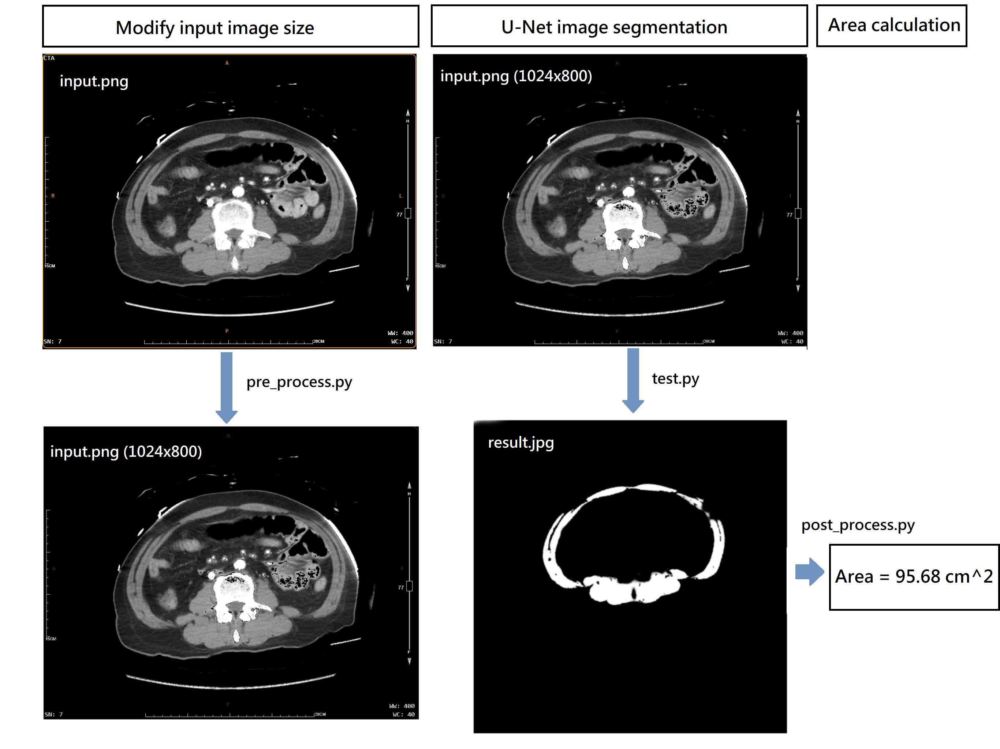

U-Net之訓練資料集由臺大醫院(NTUH)協助提供

僅供學術用途，禁止用於違法行為。

# 訓練資料集
# step 1.
將訓練資料集的原始圖檔放在 ./data/JPEGImages/
# step 2.
將訓練資料集的註記的資料放在 ./data/SegmentationClass/
# step 3.
執行 train.py，訓練完的模型參數會命名為 unet.pth 儲存在 ./param/

# 圖像切割 執行步驟

# step 1.
先將待處理圖片改名為 input.png 放在 ./input/ 資料夾內 (影像尺寸應大於1024x800)
# step 2.
執行 pre_process.py，結果會自動命名為 input.png 存放於 ./testing_set/
# step 3.
執行 test.py，經處理過的圖片會命名為 result.jpg 存放於 ./result/
# step 4.
執行 post_process，計算出 result.jpg的肌肉面積後顯示在 terminal 以及新視窗中
